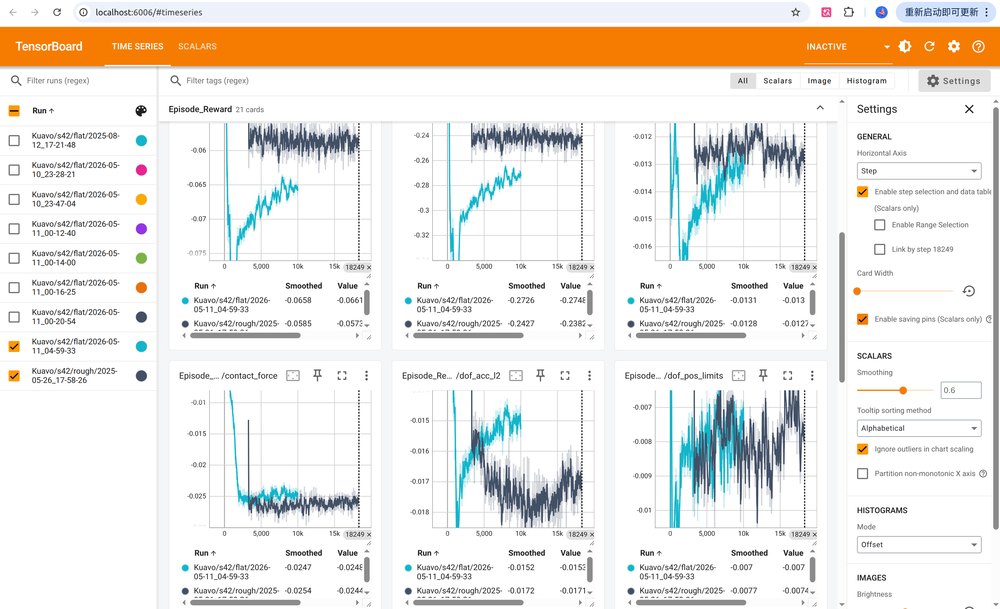

---

# 乐聚 Kuavo 强化学习 (Isaac Lab) 训练阶段全流程避坑与部署指南

**适用硬件环境**: 刚需Nvidia显卡，显存至少6G
**系统环境**: Ubuntu 20.04 LTS / 双显卡架构

---

## 0.Docker 镜像提取 (高阶环境转移)


### 0.1 启动并挂载容器

```bash
# 拉取包含 Isaac Sim 4.2.0 的 Docker 镜像
docker pull nvcr.io/nvidia/isaac-sim:4.2.0
# --- 使用代理前缀加速 (2026 常用) ---
docker pull docker.1ms.run/nvcr.io/nvidia/isaac-sim:4.2.0
# 运行一个临时容器（注意替换 image_name 为实际的镜像名或 ID）
docker run -itd --name isaac_temp_container image_name /bin/bash


```

### 0.2 乾坤大挪移 (将环境拷入宿主机)

我们需要把容器里的 Isaac Sim 目录完整提取到宿主机的标准路径下。

```bash
# 在宿主机创建目标存放目录
mkdir -p ~/.local/share/ov/pkg/

# 使用 docker cp 将容器内的 isaac-sim 提取到宿主机
# (注意：/path/to/isaac-sim 需替换为容器内实际的安装路径)
docker cp isaac_temp_container:/path/to/isaac-sim ~/.local/share/ov/pkg/isaac-sim-4.2.0

# 提取完成后，清理临时容器
docker stop isaac_temp_container
docker rm isaac_temp_container


```

*至此，你的宿主机已经拥有了绿色的 Isaac Sim 核心引擎，且无需忍受恶心的依赖报错。*

---

## 1. 业务层代码下载与版本锁定

强化学习的代码库版本必须严格对应，差一个 commit 都可能导致 API 不兼容。

### 1.1 克隆 Isaac Lab 1.4.1

```bash
cd ~
git clone -b v1.4.1 https://github.com/isaac-sim/IsaacLab.git


```

### 1.2 克隆 rsl_rl (严格回退版本)

* **⚠️ 避坑警告**: 必须回退到特定 commit，否则训练脚本会因接口改动而崩溃。

```bash
cd ~
git clone https://github.com/leggedrobotics/rsl_rl.git
cd rsl_rl
# 强制切换到官方支持的稳定版本
git checkout 386875591808cfd1462a42446b1fa0a22ac161d0


```

### 1.3 克隆乐聚 Kuavo 官方仓库

```bash
cd ~
git clone https://gitee.com/leju-robot/leju_robot_rl.git


```

### 1.4 Git LFS 安装与大文件追踪

* **⚠️ 避坑警告**: 强化学习产生的模型文件较大，若不安装 LFS 并在 Git 中追踪，上传代码后模型文件会损坏。

```bash
# 安装 Git LFS
sudo apt update
sudo apt install git-lfs

# 初始化并追踪大文件格式
git lfs install
git lfs track "*.onnx"
git lfs track "*.pth"
git lfs track "*.bin"
git add .gitattributes

```

---

## 2. 软链接与虚拟环境搭建 (生死线)

### 2.1 建立软链接 (嵌套软链接天坑)

* **⚠️ 避坑警告**: Linux 的 `ln` 命令在目标文件夹已存在时，会产生“套娃”现象。这会导致后续报 `ModuleNotFoundError: No module named 'omni.isaac.kit'`。

```bash
# 1. 强行删掉可能存在的错误旧软链接（防止套娃）
rm -rf ~/IsaacLab/_isaac_sim
# 2. 重新建立正确的软链接，桥接我们刚从 Docker 提取出的引擎
ln -s ~/.local/share/ov/pkg/isaac-sim-4.2.0 ~/IsaacLab/_isaac_sim


```

### 2.2 创建 Conda 虚拟环境

* **注意**: 必须确保 Conda 渠道优先级严格。

```bash
conda config --add channels conda-forge
conda config --set channel_priority strict

# 使用 Isaac Lab 的脚本创建环境
cd ~/IsaacLab
./isaaclab.sh --conda isaaclab
conda activate isaaclab


```

### 2.3 注入底层路径与依赖安装 (找不到模块的元凶)

* **⚠️ 避坑警告**: 必须执行 `setup_python_env.sh`，否则纯 Python 启动时会彻底瞎掉，找不到任何 `omni` 底层 C++ 模块。

```bash
# 1. 注入 Isaac Sim 底层路径
source ~/.local/share/ov/pkg/isaac-sim-4.2.0/setup_python_env.sh

# 2. 安装其余扩展库
cd ~/IsaacLab
./isaaclab.sh --install rl_games

cd ~/leju_robot_rl
pip install -e leju_robot_rl/exts/ext_template

cd ~/rsl_rl
pip install -e .


```

---

## 3. 源码精准修改 (业务层避坑)

### 3.1 禁用关节加速度更新

在开始训练前，根据乐聚要求，必须禁用关节加速度更新。

* **⚠️ 避坑警告**: 用 VS Code 打开该文件后，不要乱用全局搜索替换。只能注释掉 82 行附近 `update` 函数里的那一行 `self.joint_acc`，绝不能碰到 `self._joint_acc`！
* **文件路径**: `~/IsaacLab/source/extensions/omni.isaac.lab/omni/isaac/lab/assets/articulation/articulation_data.py`

```python
    def update(self, dt: float):
        # update the simulation timestamp
        self._sim_timestamp += dt
        # self.joint_acc  <---- 【仅在前面加 # 注释这一行！！！】


```

### 3.2 官方进阶奖励函数：防止停下摔倒逻辑

针对在 Rough 环境中训练后，机器人从行走状态停止时容易站不稳的问题，可在 `mdp/rewards.py` 中参考以下逻辑：

```python
def gravity_aligned_when_stopping(env, command_name, asset_cfg=SceneEntityCfg("robot")):
    # 当指令速度趋于0时触发逻辑
    is_zero_cmd = torch.norm(env.command_manager.get_command(command_name)[:, :2], dim=1) < 0.05
    asset = env.scene[asset_cfg.name]
    
    # 获取躯干俯仰角 (Pitch)，越接近 0 (垂直) 奖励越高
    root_quat = asset.data.root_link_quat_w
    w, x, y, z = root_quat[:, 0], root_quat[:, 1], root_quat[:, 2], root_quat[:, 3]
    pitch = torch.asin(2.0 * (w * y - x * z))
    
    reward = torch.exp(-5.0 * torch.square(pitch))
    masked_reward = torch.zeros_like(reward)
    masked_reward[is_zero_cmd] = reward[is_zero_cmd]
    return masked_reward

```

---

## 4. 终极启动连招 (防核显崩溃与僵尸进程)

由于笔记本电脑是核显加独显的组合，在使用纯 Python 启动环境时，极易遭遇连环坑：

1. **僵尸进程锁**: 上次意外退出导致 `Failed to acquire exclusive lock`。
2. **X11 显卡死锁**: 底层尝试调用显示器产生冲突，报 `Segmentation fault` (段错误)。
3. **环境变量丢失**: 纯 Python 启动缺失 `EXP_PATH` 和 `CARB_APP_PATH`。

**每次训练前，请在终端严格一次性复制并执行以下“全包裹护城河”脚本**：

```bash
# 1. 暴力砸锁：斩杀所有卡死的后台进程并清空缓存锁
pkill -9 -f kit
pkill -9 -f python
rm -rf ~/.local/share/ov/pkg/isaac-sim-4.2.0/kit/cache/*

# 2. 激活环境进入目录
conda activate isaaclab
cd ~/leju_robot_rl

# 3. 物理级“拔管”：切断图形界面显示，彻底根除 X11 段错误！
unset DISPLAY

# 4. 强制补齐引擎所需的全部底层环境变量
source ~/.local/share/ov/pkg/isaac-sim-4.2.0/setup_python_env.sh
export EXP_PATH=$HOME/IsaacLab/source/apps/isaaclab.python.headless.kit
export CARB_APP_PATH=$HOME/.local/share/ov/pkg/isaac-sim-4.2.0/kit
export ISAAC_PATH=$HOME/.local/share/ov/pkg/isaac-sim-4.2.0

# 5. 挂载显卡隔离与网络离线护盾
export VK_ICD_FILENAMES=/usr/share/vulkan/icd.d/nvidia_icd.json
export WANDB_MODE=offline


```

---

## 5. 性能压榨与训练参数设置 (16GB 内存生存指南)

在 16GB 系统内存 + 8GB 显存的限制下，机器人数量 (`num_envs`) 和录像功能 (`--video`) 会对系统产生致命影响。官方推荐使用 `--headless`（无界面模式）进行训练。

### 5.1 方案 A：极限冲刺模式 (睡前挂机首选)

* **参数**: 8192 个机器人，**绝对禁止录像** (`--headless`)。
* **表现**: 显存占用 ~6.7 GB，系统内存占用 ~55%，GPU 功耗 ~102W，采样速度可达 **43000+ steps/s**。
* **命令**:

```bash
python scripts/rsl_rl/train.py --task Legged-Isaac-Velocity-Flat-Kuavo-S42-v0 --num_envs 8192 --headless


```

### 5.2 方案 B：录像抽检模式 (阶段性查看效果)

* **⚠️ 避坑警告**: 开启 `--video` 会启动 Replicator 渲染引擎。如果在 1024 数量下开启视频，庞大的渲染缓冲区会瞬间击穿 16GB 内存，导致 Linux 强杀进程 (`已杀死` OOM)。
* **参数**: 128 或 256 个机器人，开启录像。
* **命令**:

```bash
python scripts/rsl_rl/train.py --task Legged-Isaac-Velocity-Flat-Kuavo-S42-v0 --num_envs 256 --headless --video


```

### 5.3 官方基准模型 (Baseline) 局限性说明

* **⚠️ 注意事项**: 官方提供的配置为基础示例，旨在实现行走与抗推，但存在以下已知缺点：
1. 转向性能较差。
2. 踏地感较重。
3. 步态对称性欠佳。


---

## 6. 录像解码与查看 (视频无法播放问题)

录制的 `.mp4` 视频存放在：`~/leju_robot_rl/logs/rsl_rl/Kuavo/s42/flat/【日期】/videos/train/`。

* **⚠️ 避坑警告**: Ubuntu 自带播放器缺少 H.264 解码器。如果通过终端安装 `ubuntu-restricted-extras`，经常会因为网络（梯子）原因卡死在下载微软字体（`ttf-mscorefonts-installer`）的步骤。
* **最省心解决办法**: 直接安装全能播放器 VLC。

```bash
sudo apt update
sudo apt install vlc


```

安装后，直接右键点击视频文件，选择“使用 VLC 媒体播放器打开”即可。

---

## 7. TensorBoard 训练曲线查看与解读 (炼丹指标)

TensorBoard 是我们监控强化学习网络收敛情况的“心电图”。

### 7.1 启动 TensorBoard

必须在 `isaaclab` 环境下启动，指向 `logs/rsl_rl` 目录可以同时查看多次训练的对比：

```bash
conda activate isaaclab
cd ~/leju_robot_rl

# 启动指令（如果报 pkg_resources 错误，请先执行 pip install --upgrade setuptools）
tensorboard --logdir=logs/rsl_rl

```

随后在浏览器中打开：`http://localhost:6006/`


### 7.2 核心曲线解读指南 (怎么看模型练没练废)

在强化学习中，曲线的走向决定了机器人的生死与步态质量。**核心法则是：存活率越高越好，误差越低越好，惩罚项（负数）越接近 0 越好。**

#### A. 存活与死亡指标 (`Episode_Termination`)

这是最优先看的指标，决定了机器人能不能站住。

* **`time_out` (超时存活)**: 成功坚持到回合最大步数（没有摔倒）的机器人数量。**完美曲线：开局快速攀升，并稳定在高位 (如 8.0+)。** 这说明机器人已经掌握了基本的站立和行走，不容易死。
* **`base_contact` (躯干触地/摔倒)**: 因为躯干碰地而导致回合终止的惩罚。**完美曲线：开局极高，随后断崖式下降，最终贴近 0。** 这说明网络学会了不摔跤。
* **`dof_pos_illegal` (非法关节位置)**: 关节角度超限。通常在训练中后期也会慢慢降到极低的值。

#### B. 速度跟随误差 (`Metrics`)

决定了机器人能不能精准听从遥控器的指挥（你想让它走 1m/s，它绝不走 0.8m/s）。

* **`error_vel_xy` (XY轴线速度误差)**: 实际平移速度与输入指令的偏差。**完美曲线：迅速下降并收敛到低位 (如 0.8 以下)。**
* **`error_vel_yaw` (偏航角速度误差)**: 原地旋转时的误差。同样应该**平滑下降并收敛**，否则实机走起来会跑偏。

#### C. 步态质量与惩罚项 (`Episode_Reward`)

决定了机器人走得“好不好看”、“省不省电”。**注意：图表中的大多数“Reward”其实是惩罚项（值为负数），曲线往上走（向 0 收敛）才是好的！**

* **`feet_air_time` (腾空时间)**: 这是真正的奖励（正数）。**曲线应该稳步上升。** 这代表机器人学会了像人一样抬腿迈步，而不是在地上“滑行”或“拖沓”。
* **`dof_torques_l2` / `dof_power_l2` (力矩与功率惩罚)**: 限制电机过度输出。**曲线应从极低的负数向上攀升。** 说明机器人从开局的“疯狂抽搐”变得越来越“省力高效”。
* **`action_rate_l2` / `action_smoothness` (动作平滑度惩罚)**: **曲线应向上攀升收敛。** 惩罚相邻两帧动作变化过大。收敛得越好，实机运行时电机越安静，动作越丝滑，不容易引起机体震荡。
* **`feet_slide` (滑步惩罚)**: **曲线应向上攀升收敛。** 惩罚脚落地时还有水平速度。这能逼迫机器人做到“踩实了再发力”。
* **`flat_orientation_l2` (躯干姿态惩罚)**: **曲线应向上攀升贴近 0。** 惩罚躯干不垂直地面的行为，确保机器人走起来是挺胸抬头的，而不是歪七扭八。

> **经验总结**：如果 `time_out` 一直在底下趴着，`base_contact` 居高不下，说明模型根本没学会走路（可能陷入了局部最优），不要浪费时间，直接停掉调整 Reward 权重或检查 Observation 设置重新跑。